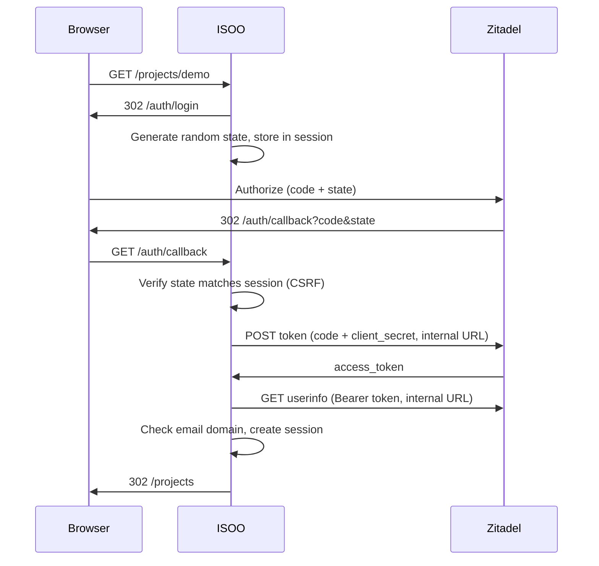

# Zitadel (example IdP)

**Audience:** platform teams wiring ISOO to an identity provider.

ISOO authenticates users with **OpenID Connect (OIDC)**. It does not implement its own user database: every login is delegated to an IdP. The Docker Compose stack ships **Zitadel** as a **reference example** — the same `OIDC_*` variables work with Azure AD, Keycloak, Okta, or any provider that exposes a standard discovery document.

This page walks through Zitadel specifically. For provider-agnostic behaviour (sessions, domain restrictions, errors), see [Authentication](./authentication.md).

## What ISOO expects from the IdP

| Requirement | ISOO usage |
|-------------|------------|
| OpenID Connect discovery | `{issuer}/.well-known/openid-configuration` |
| Grant type | **Authorization Code** (`response_type=code`) |
| Scopes | `openid email profile` |
| Callback URL | Exactly `OIDC_REDIRECT_URI` (default `/auth/callback` on the app host) |
| Client type | **Confidential** — ISOO exchanges the code server-side with `client_id` + `client_secret` |
| User claims | `email` (required for access control), `name` or `preferred_username` (display) |

ISOO stores only `email` and `name` in the Rack session after login. It does not persist IdP tokens in the session cookie.

## Secure OIDC flow (recommended)

The flow ISOO implements is the standard **OAuth 2.0 Authorization Code** pattern with extra hardening:



**Security properties:**

1. **Authorization Code** — credentials never pass through the browser; only a one-time `code` is returned to the callback.
2. **`state` parameter** — random value bound to the server session; mismatch rejects the callback (CSRF protection).
3. **Confidential client** — token exchange runs **only on the server** with `OIDC_CLIENT_SECRET`; the secret is never exposed to browsers or JavaScript.
4. **Split issuer URLs** — browsers use the **public** issuer (`OIDC_ISSUER`); the app container uses an **internal** reachability URL (`OIDC_ISSUER_INTERNAL`) for discovery, token, and userinfo calls. This avoids broken back-channel requests when the public hostname is not resolvable inside Docker.
5. **Session cookie** — signed with `SESSION_SECRET`; idle expiry via `SESSION_IDLE_TIMEOUT_SECONDS`.
6. **Domain allow-list** — optional `AUTH_ALLOWED_EMAIL_DOMAINS` enforced at callback **and** on every request.

### Production checklist

| Control | Recommendation |
|---------|----------------|
| Transport | **HTTPS** for ISOO, Zitadel, and all `OIDC_*` URLs exposed to browsers |
| Secrets | Generate `SESSION_SECRET` (64+ random bytes) and `OIDC_CLIENT_SECRET` from a vault; never commit them |
| Dev bypass | Keep `AUTH_DISABLED=0` in production |
| Email policy | Set `AUTH_ALLOWED_EMAIL_DOMAINS` to your organisation domain(s) |
| Idle sessions | Tune `SESSION_IDLE_TIMEOUT_SECONDS` (default 7200 s) to your policy |
| Zitadel app | Turn off **dev mode** on the OIDC application; restrict redirect URIs to your real callback URL(s) |
| Logout | Register post-logout redirect URIs in Zitadel if you extend logout beyond ISOO’s session clear |
| Encryption | Set `ENCRYPTION_SECRET` for confidential document encryption — separate from auth, but part of a secure deployment |

Do **not** expose Zitadel’s default bootstrap password (`Password1!`) or the admin PAT outside local development.

## Docker Compose (development example)

The repository bundles Zitadel, Postgres, MailCatcher, and ISOO. On first boot the app entrypoint runs `bin/setup-zitadel-oidc`, which:

1. Waits for Zitadel to become ready
2. Creates an **ISOO** project and OIDC application via the Zitadel Management API
3. Writes client credentials to `docker/zitadel/oidc.env`

```bash
docker compose build
docker compose --profile local-idp up -d
```

| URL | Purpose |
|-----|---------|
| http://localhost:9292 | ISOO |
| http://localhost:8080 | Zitadel console |
| http://localhost:1080 | MailCatcher (dev email) |

Default Zitadel admin (**development only**): `admin@zitadel.localhost` / `Password1!`

Login flow for developers:

1. Open ISOO → redirect to Zitadel login
2. Sign in with a Zitadel user (create users in the console if needed)
3. ISOO receives `email` + `name` and opens `/projects`

The auto-provisioned OIDC app uses `devMode: true` in `bin/setup-zitadel-oidc` — acceptable for local Compose, **not** for production.

## Manual Zitadel configuration (production-oriented)

When Zitadel runs outside Compose (managed service or your own cluster), configure it to match what ISOO expects.

### 1. Instance and URLs

Decide two URLs:

| Variable | Example | Used by |
|----------|---------|---------|
| `OIDC_ISSUER` | `https://auth.example.com` | Browser redirects, discovery document hostname |
| `OIDC_ISSUER_INTERNAL` | `https://auth.example.com` or internal service URL | ISOO server token/userinfo calls |

If ISOO and Zitadel share a Docker network, `OIDC_ISSUER_INTERNAL` can be an internal hostname (e.g. `http://zitadel:8080`) while browsers still use the public HTTPS issuer.

### 2. Create an OIDC application in Zitadel

In the Zitadel console (or Management API):

1. Create a **Project** (e.g. `ISOO`).
2. Add an application:
   - Type: **Web**
   - Auth method: **Basic** (client secret sent on token request)
   - Response type: **Code**
   - Grant types: **Authorization Code** (refresh token optional; ISOO does not rely on refresh today)
   - Redirect URI: your exact callback, e.g. `https://isoo.example.com/auth/callback`
   - Post-logout redirect (optional): `https://isoo.example.com/`
   - **Dev mode: off** in production
3. Copy **Client ID** and **Client Secret**.

Ensure users have verified **email** addresses — ISOO uses email for attribution on document commits and for domain restrictions.

### 3. Wire ISOO environment variables

```bash
AUTH_DISABLED=0
SESSION_SECRET=<64-byte-random-hex>
SESSION_IDLE_TIMEOUT_SECONDS=7200
AUTH_ALLOWED_EMAIL_DOMAINS=example.com

OIDC_ISSUER=https://auth.example.com
OIDC_ISSUER_INTERNAL=https://auth.example.com
OIDC_CLIENT_ID=<from Zitadel>
OIDC_CLIENT_SECRET=<from Zitadel>
OIDC_REDIRECT_URI=https://isoo.example.com/auth/callback
```

Restart the ISOO app after changing these values.

With Docker Compose, put external IdP values in `.env`. When `OIDC_CLIENT_ID` and `OIDC_CLIENT_SECRET` are set, the entrypoint skips bundled Zitadel bootstrap and does not load `docker/zitadel/oidc.env`. Start **without** `--profile local-idp` so Postgres/Zitadel containers are not started.

### 4. Verify discovery and login

From the ISOO host (or app container):

```bash
curl -sf "$OIDC_ISSUER/.well-known/openid-configuration" | head
```

Then open ISOO in a browser, sign in, and confirm:

- Callback URL matches exactly (scheme, host, path — no trailing slash mismatch)
- User email domain passes `AUTH_ALLOWED_EMAIL_DOMAINS` if set
- Session expires after idle timeout when configured

## Troubleshooting

| Symptom | Likely cause |
|---------|----------------|
| Redirect loop or instant logout | `OIDC_REDIRECT_URI` mismatch with Zitadel app registration |
| Token exchange fails (401/502) | Wrong `client_secret`, or `OIDC_ISSUER_INTERNAL` unreachable from app |
| Discovery errors on startup | Issuer URL wrong or TLS certificate not trusted inside container |
| 403 after login | Email domain not in `AUTH_ALLOWED_EMAIL_DOMAINS` |
| Login works locally, fails in Docker | Browser uses `localhost:8080` but app uses `zitadel:8080` — set both issuer variables explicitly |
| `oidc.env` missing | Zitadel not ready yet; wait and check `docker compose logs zitadel` |

For local work without any IdP:

```bash
AUTH_DISABLED=1 docker compose up -d app
```

Use **only** for development, CI, and automated tests.

## Using another IdP

Zitadel is one example. Any OIDC provider that supports Authorization Code + confidential client + `openid email profile` scopes can replace it:

1. Register ISOO as a web/OIDC client with the same redirect URI and scopes.
2. Map the same `OIDC_*` and session variables.
3. Remove or ignore the bundled Zitadel services in Compose if you do not need them.

See [Authentication](./authentication.md) and [Configuration](./configuration.md) for the full variable reference.

## See also

- [Authentication](./authentication.md) — sessions, domain restrictions, error codes
- [Configuration](./configuration.md) — environment variable reference
- [Install](./install.md) — Docker Compose quickstart
